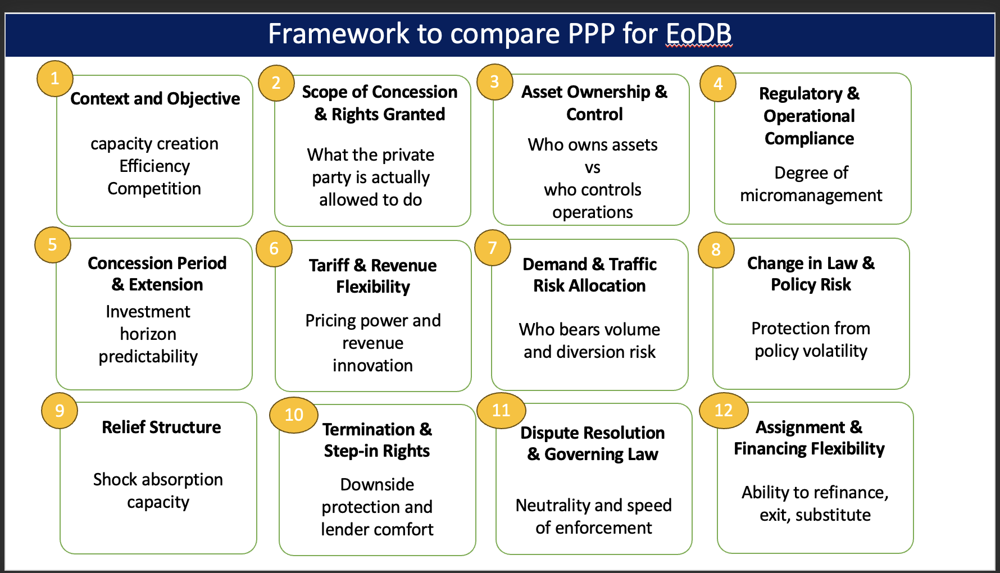

# PPP LLM Contract Analysis

This project analyzes PPP / concession agreements using LLMs and generates structured legal analysis and Word reports.



# analysis_docs/
Final Word (`.docx`) reports combining all 12 sections.

## How to read this document

Each section contains **LLM-generated analysis** of the contract and is structured into the following major subsections:

### Legal Position  
Explains what the contract explicitly allows, restricts, or mandates, based strictly on the wording of the agreement.

### Economic Implication  
Describes the commercial and cost-related consequences that arise directly from the contractual provisions.

### Bankability Impact  
Explains how lenders and investors are likely to view the clause structure in terms of risk, enforceability, and financing comfort.

### Clause Evidence  
Provides **verbatim excerpts from the contract**, including clause or article numbers where available.  
This section should be used to verify that the analysis is grounded in the actual contract text.

### Evidence Strength  
Indicates how clearly the contract supports the analysis:
- **STRONG** – Clear and direct clauses exist  
- **MODERATE** – Covered indirectly or across multiple clauses  
- **WEAK** – Mentioned ambiguously  
- **NONE** – Not provided in the document

### Confidence Assessment  
Summarizes the overall confidence level for the section based on the strength and clarity of the clause evidence.


## Folder Structure

ppp_llm_work/

## Folder & File Description

### extracted_text/
Text extracted from contract PDFs.  
Each `.txt` file represents one agreement.

### vectorDB/
Vector databases for semantic search.  
One subfolder per document containing text embeddings.

### outputs/
Section-wise analysis in JSON format.  
Each document folder contains 12 JSON files (one per analysis section).

### utils/
Helper code.
- vecDb.py – vector DB creation and retrieval  
- prompt.py – LLM prompts

### extract.ipynb
Main pipeline notebook: builds vector DB, runs analysis, saves outputs.

### main.ipynb
High-level runner and experiments.

### rough_code.ipynb
Sandbox for testing.

### .env
Environment variables (API keys).

## Setup & Run (Replication Guide)

### Python version
This project was tested with **Python 3.10.19**.  
Use Python 3.10.x for best compatibility with the current dependencies.

### 1) Create and activate a virtual environment
Mac/Linux:
```bash
python -m venv venv
source venv/bin/activate
```
Windows (PowerShell):
```powershell
python -m venv venv
venv\\Scripts\\Activate.ps1
```
Windows (CMD):
```cmd
python -m venv venv
venv\\Scripts\\activate.bat
```

Each user should create their own `venv` and install dependencies.

### 2) Install dependencies
Use the pinned `requirements.txt` (generated from the working environment):
```bash
pip install -r requirements.txt
```

### 3) Create `.env`
Create a `.env` file in the project root and add:
```env
OPENAI_API_KEY=your_openai_key_here
AWS_REGION=ap-south-1
S3_BUCKET=textract-input-happy
S3_PREFIX=
RAG_TOP_K=12
OPENAI_MAX_CONCURRENCY=2
OPENAI_MAX_RETRIES=4
OPENAI_RETRY_BASE_SECONDS=5
```

Notes:
- `OPENAI_API_KEY` is required for all LLM analysis.
- AWS credentials (for Textract + S3) must be configured in your environment (e.g., `AWS_ACCESS_KEY_ID`, `AWS_SECRET_ACCESS_KEY`) or via AWS profiles.

### 4) Run document analysis (JSON + DOCX)
```bash
python docu_analyser.py "DOCUMENT_NAME"
```
This reads `extracted_text/<DOCUMENT_NAME>.txt`, uses `vectorDB/<DOCUMENT_NAME>/`, writes section JSONs into `outputs/<DOCUMENT_NAME>/`, and generates:
```
analysis_docs/<DOCUMENT_NAME>_PPP_Legal_Analysis.docx
```

### 5) Run document comparison (multi-query + DOCX)
```bash
python compare.py "DOC_A" "DOC_B"
```
Outputs:
- JSON files per query:
```
doc_compare/DOC_A_&DOC_B_compare/
```
- Combined DOCX:
```
doc_compare/DOC_A_&DOC_B_compare.docx
```

### 6) Streamlit apps (optional)
If you want a UI:
```bash
streamlit run app.py
```
Or the LangGraph version:
```bash
streamlit run app2.py
```

### .gitignore
Git ignore rules.
